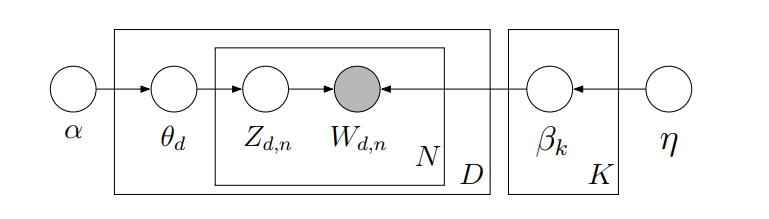

---
---
 

 
 

## Topic Models Blog Serie

This is the third blog of a six part serie on "Learning, training and scaling topic models: a practical approach in R". The serie covers:

  1. What are [topic models](what_is_topic_modeling.html) (TM)?
  
  2. A little [introduction to LDA](what_is_LDA.html)
  
  3. A gentle look into the Bayesian statistics behind TM

  4. How to [train TM and visualise outputs](how_to_train_TM_in_r.html) in R?

  5. Setting up [AWS with R for scaling](how_to_run_R_on_aws.html) TM

  6. How does the TM algorithm work under the hood? (To come)
  
We will use 3 of Jane Austen's books to illustrate our examples: Sense and Sensibility, Pride and Prejudice and Persuasion. We will download and process the Austen corpus with the help of the gutenbergr package.

## Intuition behind Bayesian statistics
The intuition behind Bayes's theorem can be understood with the following image: think of your brain as a guessing machine. In a complex, noisy and ambiguious world, how does the brain actually makes decisions? Well, it uses both known information and best guesses on missing information to decide on what to do next. This process is called "unconscious inferences": by constantly forming hypothesis (our beliefs) about what the present is and by evaluating those hypothesis based on current evidence and prior knowledge, we can decide on the next best action to take. This can be express with the mathematical equation below:

$$
Posterior Probability Of An Event = \frac{Prior Knowledge * Likelihood}{Evidence   (Marginal Likelihood)}
$$

In statistical terms, the Bayes's theorem can also be written like this:

$$
P(H | D) = \frac{P(H) * P(D|H)}{P(D)}
$$
where P is the probability, H stands for Hypothesis and D for Data. P(H|D) is the posterior, P(D|H) is the likelihood, P(H) is the prior and P(D) is the evidence. Now, let's look at an example of the usage of the Bayes theorem to figure out if it is going to rain today.

The Posterior Probability is written as P(Hypothesis | Data) which is the probability of the hypothesis given the data. In our example, it is the probability that it is going to rain today (hypothesis) given the dark cloud we see outside the window (data). The Likelihood P(Data | Hypothesis) is the probability of the data given the hypothesis: How likely is it that the clouds look the way they do now when we actually know that it is going to rain. The Prior is P(Hypothesis) and represents our prior knowledge about the hypothesis before we collect any new data, e.g, how likely is it that it is going to rain today?

As a side note, the numerator of the Bayesian equation is sometimes called the joined probability. The denominator P(Data) is the evidence also called the marginal likelihood or marginal probability. It is the probability of seen the observed clouds under any given days. At this stage, let's  say that the main purpose of the denominator is to get a posterior value ranging from 0 to 1.

## The grafical model, the posterior and the bayesian problem to solve
LDA is a **generative probabilistic model**. This means that given an observable variable D and the hidden variables A, B and C, **the posterior**  of A,B,C and D is P(A, B, C | D). This probabilitic generative process can be best represented as a **grafical model** that expresses the conditional dependence structure between the random variables of the model. 

In the grafical model above the nodes denote random variables; dark nodes are observed data and white nodes are hidden variables that we are trying to estimate; edges (arrows) denote dependence between the random variables. These random variables can be in rectangles. Those are "plate notation" which represent random variables that are repeated/replicated.

Grafical models are tools to visualize the bayesian inference problem that we are trying to solve. For example the graphical model above can be written as such:

$$
P(A,B,C|D) = \frac {P(A) * P(B) * P(C|B) * P(D|A,C)}{P(D)}
$$
where the probability of A, B and C given D (posterior) is equal to the multiplication of Prior A and B with the likelihood P(C|B) * P(D|A,C) and divided by the evidence P(D). The numerator is the **joint distribution** of all the hidden and observed random variables from the model.

## LDA Grifical Model
So how does the grafical model for LDA looks like?

In this grafical model, the observed variable are the words in the document. All other variables are hidden: the main hidden variables that we are going to estimate are the topic distribution over words and topic proportion per document: 

- Each topic is a distribution over words and that distribution over words comes from a Dirichlet distribution beta (β) with parameter eta (η).

- Each document is a distribution over topics and that distribution comes from a Dirichlet distribution theta (θ) with parameter alpha (α). 

There are two variables not in a plate: 

- α is the parameter of the Dirichlet prior on the per-document topic proportion distributions θd for D (the total number of documents in the corpus)

- η is the parameter of the Dirichlet prior on the per-topic (k) word proportion distribution βk for all K topics of the corpus. K needs to be set apriori as we have seen earlier.

Zd,n is the topic assignment or allocation for each document d and each word n from the word vocabulary N and and Wd,n which is a word from document d from vocabulary N. 

## The Joint Distribution 
The model above can be translated into the following Bayesian Inference problem where we are trying to estimate the posterior of the random variables of the hidden semantic structure θ, β and Z given the observed w. The posterior computation for LDA can be obtained with:
$$
Posterior P(θ,z,β,w|η,α) = \frac{Join Distribution} {Evidence} 
$$

where the numerator is the join distribution of all the hidden and observed variables represented as follows:

$$
JoinDistribution = ΠP(β|η) * ΠP(θ|α) * ΠP(z|θ)P(w|z,β)
$$
where: 

- Prior ΠP(β|η) represents the word proportion per topic (Dirichlet)

- Prior ΠP(θ|α) represents the topic proportion per document (Dirichlet)

- Likelihood ΠP(Z|θ)P(w|Z,β) represents the topic assigment (Multinomial)

The denominator is the marginal probability (evidence), which is the probability of seeing the observed corpus under any topic model. In theory, it can be computed by doing a sum of the joint distribution over every possible instantiation of the hidden topic structure. However, this sum is intractable to compute. Hence we have to find ways of approximating it.

There are several ways of doing this approximation. A popular way is to use the Gibbs sampling method.

## Conclusion and Next Chapter

We took a gentle dive into the bayesian statistics of the LDA model. If you want to learn more about the the bayesian statistical inference of the LDA model, you can read further mathematical explanation [here](https://en.wikipedia.org/wiki/Latent_Dirichlet_allocation).

In the next chapter, we will focus on how to train the LDA model and the data engineering steps for doing so. We will also show how to assess the number of topics we expect to find in the Austen corpus. Finally, we will see the code used to parametrise the LDA model.

## Learning ressources

- Dirichlet function in R: https://www.rdocumentation.org/packages/DirichletReg/versions/0.6-3/topics/Dirichlet

- Dirichlet wikipedia page: https://en.wikipedia.org/wiki/Dirichlet_distribution

- Professor Blei KDD Tutorial: http://www.ccs.neu.edu/home/jwvdm/teaching/cs6220/fall2016/assets/pdf/blei-kdd-tutorial.pdf

- Professor Blei lectures on Topic models at Machine Learning Summer School (MLSS), Cambridge 2009 part 1 & 2 with slides: http://videolectures.net/mlss09uk_blei_tm/

- Conjugate prior on Wikipedia: https://en.wikipedia.org/wiki/Conjugate_prior

- Introduction into Latent Dirichlet Allocation by Professor Bobby B. Lyle at SMU School of Engineering URL: https://pdfs.semanticscholar.org/presentation/7f54/8af3930a4f10a012a46bc7956ac6da8c38e3.pdf

- Monte Carlo example in R: https://rpubs.com/Koba/Monte-Carlo-Basic-Example

- Introduction to Markov Chain Monte Carlo: https://nicercode.github.io/guides/mcmc/

- Markov Chains: http://setosa.io/ev/markov-chains/

## References

- Blei DM, Ng AY, Jordan MI (2003b). “Latent Dirichlet Allocation.” Journal of Machine Learning Research, 3, 993–1022, page 1009. URL http://www.jmlr.org/papers/volume3/blei03a/blei03a.pdf

- Griffiths TL, Steyvers M (2004). “Finding Scientific Topics.” Proceedings of the National Academy of Sciences of the United States of America, 101, 5228–5235. URL http://psiexp.ss.uci.edu/research/papers/sciencetopics.pdf

- Grün, B. & Hornik, K. (2011). topicmodels: An R Package for Fitting Topic Models.. Journal of Statistical Software, 40(13), 1-30.

- Ponweiser M., "Latent Dirichlet Allocation in R", Diploma Thesis, Institute for Statistics and Mathematics, 2012. URL http://epub.wu.ac.at/3558/1/main.pdf

