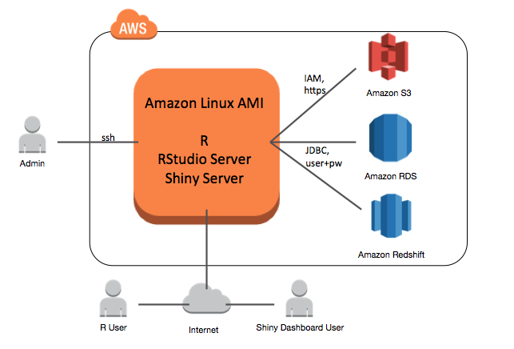
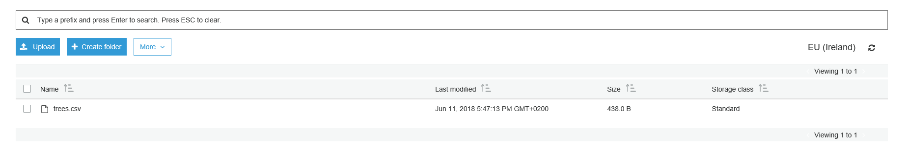
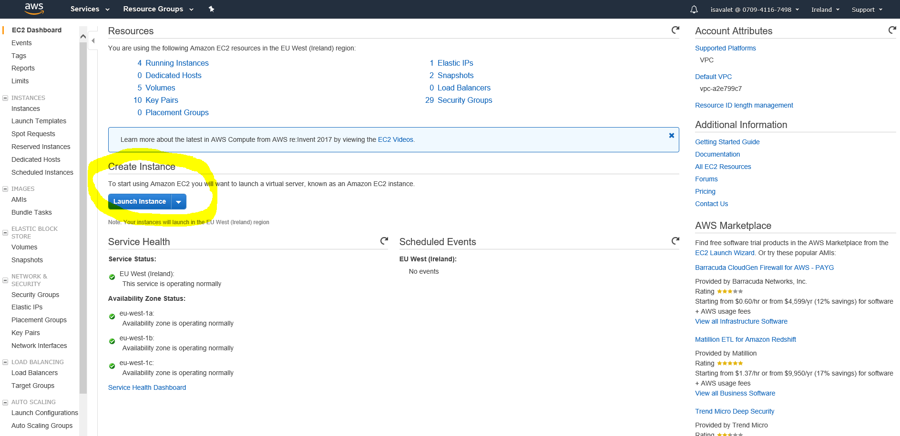
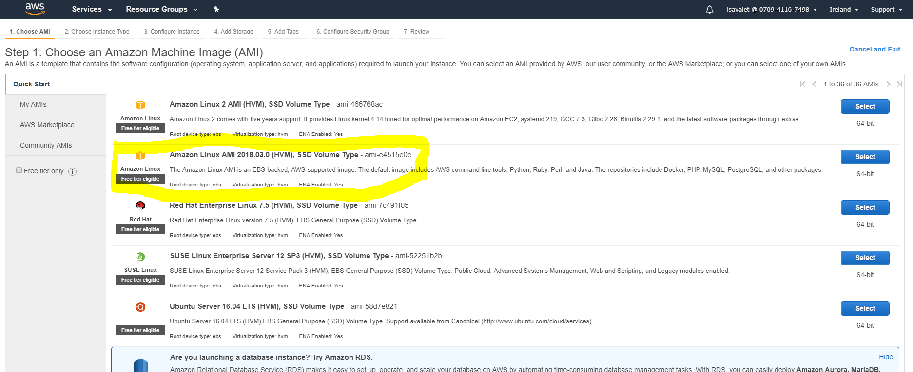
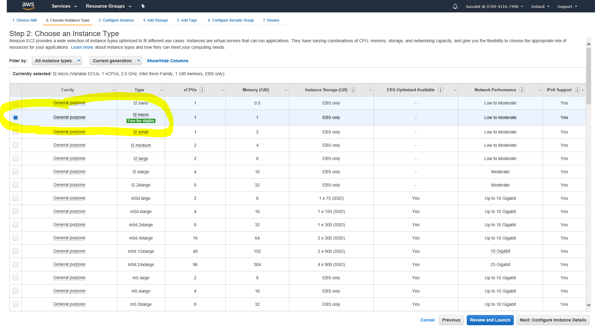
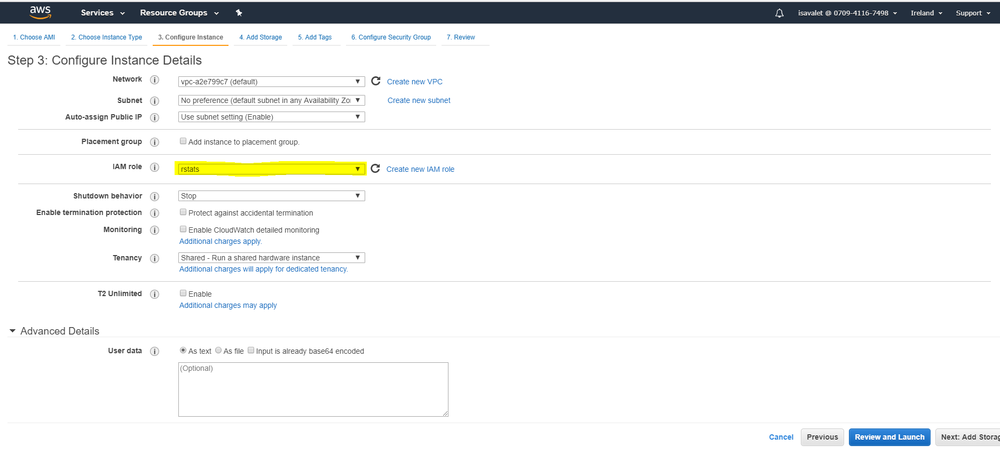
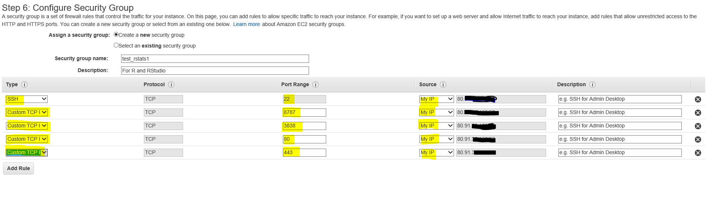
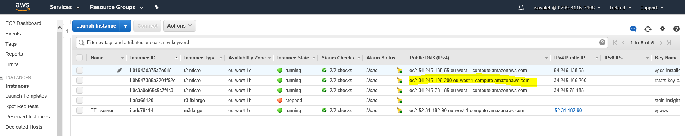

---
---
<br clear="all" />


<br clear="all" />
<br clear="all" />

## Topic Models Blog Serie

This is the 5th blog of a six part serie on "Learning, training and scaling topic models: a practical approach in R". The serie covers:

  1. What are [topic models](what_is_topic_modeling.html) (TM)?
  
  2. A little [introduction to LDA](what_is_LDA.html)
  
  3. A gentle look into the [Bayesian statistics](bayesian_statistics.html) behind TM

  4. How to [train TM and visualise outputs](how_to_train_TM_in_r.html) in R?

  5. Setting up AWS with R for scaling TM

  6. How does the TM algorithm work under the hood? (To come)

# Running R on AWS
How to scale R and RStudio with AWS? Training topic models in R can sometimes be computetionally expensive, especially if you are dealing with hundreds of thousands of document.

In this blog, we will explore the default EC2 set-up and tune it to suite the training of topic models. The architecture below shows how RStudio on EC2 interacts with other AWS services. This picture is taken from the following [AWS tutorial.](https://aws.amazon.com/blogs/big-data/running-r-on-aws/)



Why did I choose AWS and not another cloud platform? This is the platform my company uses at work hence I was able to experiment with it.  

# Before you start..

- 1. You need to have access to AWS and have your AWS credentials easily available, they look as such:

      * AWS_ACCESS_KEY_ID = "AKIAJLABCDEFGHIJKQ" 

      * AWS_SECRET_ACCESS_KEY = "ij12Kbp1YAbCDeFGhiJKJsv7IFHtrl3e0p"

      * AWS_DEFAULT_REGION = "eu-west-1"
      
- 2. You will need to create a key pair for EC2. You can read how to [here](https://docs.aws.amazon.com/AWSEC2/latest/UserGuide/ec2-key-pairs.html#having-ec2-create-your-key-pair)

- 3. Downloaded PuTTY from [PuTTY download page](https://www.chiark.greenend.org.uk/~sgtatham/putty/) if you do not already have it (windows users only). You will need to shh your way to your launched AWS EC2 instance if you are a Mac user. If you want to become more familiar with how to launch an EC2 instance, you can read more [here](https://docs.aws.amazon.com/AWSEC2/latest/UserGuide/EC2_GetStarted.html#ec2-launch-instance). We will need to convert your key pair .pem file into a .ppk file with PuTTYgen (for both Mac and Windows users). Read more on how to connect your linux EC2 instance from windows using putty [here](https://docs.aws.amazon.com/AWSEC2/latest/UserGuide/putty.html)

- 4. Create a test S3 bucket to play around from/to R. Log in AWS [here](https://eu-west-1.console.aws.amazon.com/console/home?region=eu-west-1). Choose "Services" then "S3" under "storage" where you can see the buckets. You can do the same in R as follows:

```{r connectS3, eval = FALSE}
#install.packages('aws.s3',repos=c('cloudyr'='http://cloudyr.github.io/drat'))
library("aws.s3")
AWS_ACCESS_KEY_ID = Sys.getenv("AWS_ACCESS_KEY_ID")
AWS_SECRET_ACCESS_KEY = Sys.getenv("AWS_SECRET_ACCESS_KEY")
AWS_DEFAULT_REGION =  Sys.getenv("AWS_DEFAULT_REGION")

bucketlist()
```

Create a new folder for your user. We will call it "vg-insight-dev/users/isavalet" for example purposes. You are now ready to transfer files from/to s3 and from/to R as shown below.

```{r transfers3, eval = FALSE}
# assign your bucket
bucket_name <- "vg-insight-dev/users/isavalet"
# trees is a built-in data set. Let's create a new CSV file that we can upload to AWS S3.
write.csv(trees, "trees.csv", row.names = FALSE)
bucket_name <- "vg-insight-dev/users/isavalet"

# Now we can create the bucket from R.
 put_bucket(bucket_name)

# Let's put our CSV file in the bucket.
put_object("trees.csv", bucket = bucket_name)
# We've put data in The Cloud! 
```

The csv is now in your S3 folder visible from the AWS console.


```{r uploads3, eval=FALSE}
#  Now let's get it back on our computer and compare that it is the same file:
save_object("trees.csv", bucket = bucket_name, file = "trees_s3.csv")

# Are the files the same?
trees_s3 <- read.csv("trees_s3.csv")
all.equal(trees, trees_s3)

# We're finished with this bucket, so let's delete it.
delete_bucket(bucket_name)
```

- 5. Create an IAM role for your R EC2 instance. In the AWS menu, select IAM from "Security, Identity & compliance". Create a new role called "rstats". Attach the policy for "AmazonS3FullAccess" and the following Json policy manually.

```{r eval=FALSE}
{
    "Version": "2012-10-17",
    "Statement": [
        {
            "Effect": "Allow",
            "Action": [
                "s3:ListBucket"
            ],
            "Resource": [
                "arn:aws:s3:::rstatsdata"
            ]
        },
        {
            "Effect": "Allow",
            "Action": [
                "s3:PutObject",
                "s3:GetObject",
                "s3:DeleteObject"
            ],
            "Resource": [
                "arn:aws:s3:::rstatsdata/*"
            ]
        }
    ]
}
```


# Launching an EC2 Instance

In the AWS console, click on "services" and choose "EC2". 

- 1. Click on "Launch Instance"



- 2. Choose the AMI Amazon Linux AMI 



You can use a free “t2.micro” image while building, then provision more resources later once you’re ready for analysis. t2.micro is free. Kepp in mind that it may have less ressources than your own laptop.

- 3. Choose an Instance Type



- 4. Configure Instance details



Under IAM Role, select the "rstat" role your previously created. Do not add any code on "Advanced details". It was only necessary with an earlier AMI version.

You do not need to change anything on the tabs "Add storage", "Add tags".

- 5. Configure Security Group



When you get to the ‘Security Groups’ tab, create a new security group that has the following ports open with type "SSH" for port 22 and Custom TPC Rule" for port 80 (HTTP), 443 (HTTPS), 3838 (Shiny), and 8787 (RStudio Server).

Security wise, I chose the instances to only be accessible from my IP adress since it is easy to hack R. I considered my IP adress, my key-pair, and my Rstudio password to be a sufficient level of security for my EC2 instance in the Cloud. However, should you need your security, talk to you DevOps people.

- 6. Review and launch an instance using the key pair you previously created. 

## Connecting to Amazon EC2 Instance with PuTTY/ terminal

You will find your public DNS in the EC2 dashboard.



Now, ssh your way to your instance with Putty on windows. 

On mac, do the following:
```{r eval=FALSE}
chmod 400 key-pair.pem
ssh -i /Users/path/Documents/R/key_pair.pem ec2-user@ec2-123-456-78-9.eu-location-1.compute.amazonaws.com
```

Update the R version if necessary and run the following kode. Add your own username and password.


```{r eval=FALSE}
#!/bin/bash
# install latest updates (security)
sudo yum update
#make sure that you have the lastest R version available on AWS and install R
sudo yum install -y R

#install RStudio-Server 1.0.153 (2017-07-20)
wget https://download2.rstudio.org/rstudio-server-rhel-1.1.453-x86_64.rpm
sudo yum install -y --nogpgcheck rstudio-server-rhel-1.1.453-x86_64.rpm
rm rstudio-server-rhel-1.1.453-x86_64.rpm

#install shiny and shiny-server (2017-08-25)
sudo R -e "install.packages('shiny', repos='http://cran.rstudio.com/')"
wget https://download3.rstudio.org/centos6.3/x86_64/shiny-server-1.5.7.907-rh6-x86_64.rpm
sudo yum install -y --nogpgcheck shiny-server-1.5.7.907-rh6-x86_64.rpm
rm shiny-server-1.5.7.907-rh6-x86_64.rpm

#add user(s)
sudo useradd MyUserName
sudo echo MyUserName:MyPassword | sudo chpasswd

#I have encountered a common issue installing the data.table and slam packages in R where the compiler does not seem to work. These packages are dependencies of both the "tm" and "topicmodels" R packages needed in Topic Modelling.

#The problem here is that data.table/slam packages don't play nice with the default gcc compiler (gcc72-c++.x86_64 gets installed as a dependency of R-devel.x86_64). 

#To solve this, you can edit the Makeconf file that R uses during compilation directly. If you're using Amazon Linux the file location is most likely

cd /usr/lib64/R/etc
sudo vi Makeconf
# insert the following
#   CC = gcc to CC = gcc64
# then save and exit

# for the RCurl R package
sudo yum install curl-devel
# for openssl R package
sudo yum install openssl-devel
# for xml2 R package
sudo yum install libxml2-devel
# for the slam and data.table R packages
sudo yum install gsl-devel
# needed for ldatuning
sudo yum install mpfr-devel


#install R packages needed for topic modelling
sudo R -e "install.packages('RCurl', repo = 'https://cran.uib.no/')"
sudo R -e "install.packages('openssl', repo = 'https://cran.uib.no/')"
sudo R -e "install.packages('xml2', repo = 'https://cran.uib.no/')"
sudo R -e "install.packages('base64enc', repo = 'https://cran.uib.no/')"
sudo R -e "install.packages('dplyr', repo = 'https://cran.uib.no/')"
sudo R -e "install.packages('ggplot2', repo = 'https://cran.uib.no/')"
sudo R -e "install.packages('tidyr', repo = 'https://cran.uib.no/')"
sudo R -e "install.packages('httr', repo = 'https://cran.uib.no/')"
sudo R -e "install.packages('aws.s3',repos=c('cloudyr'='http://cloudyr.github.io/drat'))"
sudo R -e "install.packages('slam', repo = 'https://cran.uib.no/')"
sudo R -e "install.packages('data.table', repo = 'https://cran.uib.no/')"
sudo R -e "install.packages('slam', repo = 'https://cran.uib.no/')"
sudo R -e "install.packages('tm', repo = 'https://cran.uib.no/')"
sudo R -e "install.packages('topicmodels', repo = 'https://cran.uib.no/')"
sudo R -e "install.packages('udpipe', repo = 'https://cran.uib.no/')"
sudo R -e "install.packages('ldatuning', repo = 'https://cran.uib.no/')"
sudo R -e "install.packages('pryr', repo = 'https://cran.uib.no/')"
sudo R -e "install.packages('Hmisc', repo = 'https://cran.uib.no/')"
sudo R -e "install.packages('tidytext', repo = 'https://cran.uib.no/')"
sudo R -e "install.packages('doParallel', repo = 'https://cran.uib.no/')"
sudo R -e "install.packages('tidyverse', repo = 'https://cran.uib.no/')"
sudo R -e "install.packages('purrr', repo = 'https://cran.uib.no/')"
sudo R -e "install.packages('devtools', repo = 'https://cran.uib.no/')"
sudo R -e "install.packages('drlib', repo = 'https://cran.uib.no/')"
sudo R -e "install.packages('wordcloud', repo= 'https://cran.uib.no/')"
```

Try to log on to Rstudio Server using the credential your previously created and the link to Rstudio server:

      http://ec2-50-19-18-XXX.compute-1.amazonaws.com:8787

The link is your public dsn followed by :8787. 
      
      
You can now log back on to RStudio server.  Load all the following R packages in your RStudio Session:
```{r eval = FALSE}
library(RCurl)
library(openssl)
library(xml2)
library(base64enc)
library(dplyr)
library(ggplot2)
library(tidyr)
library(httr)
library(aws.s3)
library(slam)
library(tm)
library(udpipe)
library(data.table)
library(topicmodels)
library(ldatuning)
library(pryr)
library(Hmisc)
library(tidytext)
library(tidyverse)
library(doParallel)
library(purrr)
library(devtools)
#install_github("dgrtwo/drlib")
library(drlib)
library(wordcloud)
```


We are now almost ready to train topic models with R on AWS - all we need is to install the stm R package. This installation has proven to be a little more challenging than expected. The stm package has quite a lot of dependencies among which the RcppArmadillo package that requires an older version of the gcc: gcc48.


So let's go back to putty or your terminal and finish the installation:
```{r eval = FALSE}
# updated the instance:
sudo yum update -y

# checked if there is any version of GCC installed in the instance:
sudo yum list installed gcc*
  
# remove all gcc instances older than 48, like the following
sudo yum remove gcc72-c++.x86_64 libgcc72.x86_64
sudo yum remove gcc64-gfortran.x86_64
sudo yum remove gcc64.x86_64 
# remove other gcc version should you have any
# since the blog post recommended to install GCC version 4.8, so did I:
sudo yum install -y gcc48

# needed for stm package
sudo yum install R-devel

cd /usr/lib64/R/etc
sudo vi Makeconf
# insert the following
#   CC = gcc64 back to CC = gcc
# then save and exit

# start R
sudo R
# once in R install stm package with dependencies
install.packages("stm", dependencies = T)
library(stm)
```

We are now fully ready to train topic models.


# References and learning materials

Amazon Web Services has a very good tutorial on how to connect R to AWS EC2
https://aws.amazon.com/blogs/big-data/running-r-on-aws/

R-Bloggers has also very good blog about the same topic
https://www.r-bloggers.com/instructions-for-installing-using-r-on-amazon-ec2/

Amazon also has many usual links to learn about EC2 related topics:

- How to get started with EC2:  https://docs.aws.amazon.com/AWSEC2/latest/UserGuide/EC2_GetStarted.html#ec2-launch-instance

- Key-Pairs: https://docs.aws.amazon.com/AWSEC2/latest/UserGuide/ec2-key-pairs.html#having-ec2-create-your-key-pair

- how to connect your linux EC2 instance from windows using putty: https://docs.aws.amazon.com/AWSEC2/latest/UserGuide/putty.html

The aws.s3 package on GitHUb has a very good tutorial on how to load data from/to R to/from S3 https://github.com/cloudyr/aws.s3

As always Stackoverflow was a main source of help when dealing with bugs during the R and RStudio installation on EC2 instances:  https://stackoverflow.com/

It may be a good idea to familiarize yourself with AWS prices since some of those EC2 instances are quite expensive: https://aws.amazon.com/ec2/pricing/on-demand/

The last bugs with RcppArmadillo was solved with: https://github.com/RcppCore/RcppArmadillo/issues/200 and the help of Deepak K. at Amazon Web Services support. Thanks a lot Deepak!


