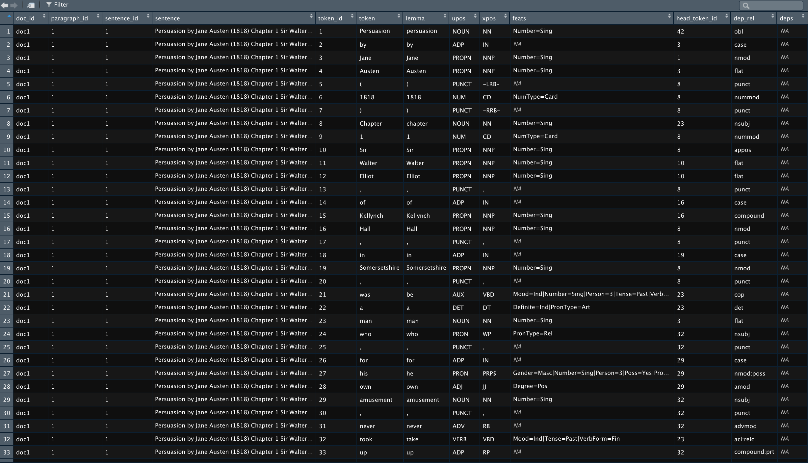

---
---
<br clear="all" />


<br clear="all" />
<br clear="all" />

# How to train TM and visualise outputs in R?

## Topic Models Blog Serie

This is the fourth blog of a six part serie on "Learning, training and scaling topic models: a practical approach in R". The serie covers:

  1. What are [topic models](what_is_topic_modeling.html) (TM)?
  
  2. A little [introduction to LDA](what_is_LDA.html)
  
  3. A gentle look into the [Bayesian statistics](bayesian_statistics.html) behind TM

  4. How to train TM and visualise outputs in R?

  5. Setting up [AWS with R for scaling](how_to_run_R_on_aws.html) TM

  6. How does the TM algorithm work under the hood? (To come)
  
We will use 3 of Jane Austen's books to illustrate our examples: Sense and Sensibility, Pride and Prejudice and Persuasion. We will download and process the Austen corpus with the help of the gutenbergr package.

In this chapter, we will focus on the data preprocessing steps of data engineering needed to create the inputs to train the LDA model, namely the [document term matrix](https://en.wikipedia.org/wiki/Document-term_matrix). We will then assess the number of topics we expect to find in the Austen corpus. Finally, we will show the code used to parametrise the LDA model. 

But first, let's download the 3 Jane Austen novels.

```{r setup, warning=FALSE, message = FALSE}
library(tidyverse) # The bible
library(tidytext) # The text bible
library(gutenbergr) # Jane Austen novels
library(udpipe) # For lemmatization and text annotations
library(Hmisc) # For %nin%
library(ldatuning) # For computing the optimal number of topics
library(topicmodels) # For training a LDA topic model
library(wordcloud) # For visualizing wordclouds
library(kableExtra) # for prettifying Rmarkdown tables
```

```{r message = FALSE}
# Downloading novels by Jane Austen
p <- gutenberg_download(105) %>% .$text %>% paste0(., collapse = " ")
pp <- gutenberg_download(1342) %>% .$text %>% paste0(., collapse = " ")
ss <- gutenberg_download(161) %>% .$text %>% paste0(., collapse = " ")

austen <- data.frame(id = c(1, 2, 3), 
                     text = c(p, pp, ss), 
                     stringsAsFactors = F)
```


## Data Engineering for Text annotation

Text annotation is a key step of the data engineering process. We used the R package [udpipe](https://github.com/bnosac/udpipe) for doing annotations. This package is available on [CRAN](https://CRAN.R-project.org/package=udpipe). 
According to [R-bloggers](https://www.r-bloggers.com/is-udpipe-your-new-nlp-processor-for-tokenization-parts-of-speech-tagging-lemmatization-and-dependency-parsing/), there aren’t many available tools which do all the text annotations:

- for multiple languages and 

- do not depend on external software dependencies (java/python) 

- which also allow you to train your own parsing & tagging models. 

...Except R package udpipe which satisfies these 3 criteria.

Udpipe enables tokenisation, speech tagging, lemmatization and dependency parsing. Dependency Parsing is the process of finding relationships between words- e.g “head” words and words which modify those heads. This allows you to look for words which may be far away from each other in the raw text but influence each other. Dependency parsing will not be used to build our LDA model as opposed to tokenisation, speech tagging and lemmatization. 

So, what are these concepts?

- Tokenization is the first step in cleaning data: it removes punctuation, spacing, handling of special characters and extract words from sentences. udpipe is also handy in the sense that it keeps track for you of document ids, paragraph and sentence id, token id, and so on, supposing that you have correct spacing/punctuation between, paragraph, sentences, etc.

- Lemmatization is an advanced form of stemming. The way it works is that it groups together the inflected forms of a word (walks, walked, walking) into its lemma (walk) so they can be analysed as a single item. An advantage of using udpipe is that it does for you the mapping between token and lemma.

- According to [wikipedia](https://en.wikipedia.org/wiki/Part-of-speech_tagging), part-of-speech tagging, also called POS tagging is the process of marking up a corpus as corresponding to a particular part of the speech based on both its definition and its context—i.e., its relationship with adjacent and related words in a phrase, sentence, or paragraph. A simplified form of this is commonly taught to school-age children, in the identification of words as nouns, verbs, adjectives, adverbs, etc. To train our LDA model, we used only Nouns, Verbs, Adjectives, Adverbs and Prop Nouns. 

Below is the code for text annotation in R with udpipe. This part of the code can be quite computationally expensive if you have a massive corpus of several hundred thousands documents. Hence the need to hook R up to AWS that we will see in the next chapter. 

More information about the quality of the udpipe model for text annotation for your language can be found [here](https://github.com/jwijffels/udpipe.models.ud.2.0/blob/master/inst/udpipe-ud-2.0-170801/README). As seen in the document, the models produce correct lemma and upos in more than 96% of the sentences. This is good enough for our purpose. I have tested both the Norwegian and English models.

```{r, cache=TRUE, message = FALSE}
# Downloading and loading the udpipe English model for lemmatization
model <- udpipe_download_model(language = "english")
model <- udpipe_load_model(model$file_model)

# Lemmatization and text annotation
annotated <- udpipe_annotate(model, x = austen$text)
annotated <- as.data.frame(annotated)
```

Now let's take a look at the annotated text and the variables in the table.

```{r}
str(annotated)
```




Let's visualize the number of lemmas based on their role in sentences.

```{r, fig.align="center", fig.height=6, fig.width=9}
annotated %>% 
  count(upos) %>% 
  arrange(n) %>% 
  ggplot(aes(x = reorder(upos, -n), y = n)) + 
  geom_bar(stat = "identity", fill = "lightblue") + 
  theme(axis.title.x = element_blank())
```

Finally, we need to concatinate 2 consecutive PROPN so that the lemma "Jane"  and "Austen" that follow each other in the same sentence, in the same paragraph, become the new lemma "Jane Austen". Here is the code to do that.

```{r}
annotated_concat <- annotated %>%
  mutate(token_id = as.numeric(token_id),
         temp = ifelse(upos == "PROPN", NA, token_id)) %>% 
  tidyr::fill(temp) %>% 
  mutate(sk_id = ifelse(upos == "PROPN", temp + 1, token_id)) %>% 
  group_by(doc_id, paragraph_id, sentence_id, sentence, sk_id) %>% 
  summarise(lemma = paste0(lemma, collapse = " "),
            upos = first(upos), 
            .groups = "drop") %>% 
  ungroup()
```

## The Document Term Matrix

First, a little word on the document-term matrix - what is it? 
It is the input data to train the LDA model. The rows in the document-term matrix correspond to all documents in the corpus and the columns are the lemmas from the corpus vocabulary. The values w(i,j) of the matrix indicate how often the word j appears in document i. It is usual to reduce the document-term matrix to the lemmas that appear in a minimum of X documents. Griffiths and Steyvers (2004) recommend to set this X value to 5. Another way to reduce the document-term matrix is to include only the lemma with the highest term-frequency inverse document frequency scores as recommended by Blei & Lafferty 2009 ([tf-idf](https://en.wikipedia.org/wiki/Tf%E2%80%93idf)) 

During the final stages of the data preprosessing to create the document term matrix, we do the following:

- remove stop words

- only select the upos Noun, Verb, Adjective, Adverb and Prop Nouns

- remove words that appear only once in the entire Austen corpus

- visialise the most frequent words

- remove the word "Chapter"

- create the [document term matrix](https://en.wikipedia.org/wiki/Document-term_matrix)

This is done in R as shown below. And let's have a look at the word that are the most frequent in the Jane Austen's novels we have chosen to look at.


```{r, fig.height=6, fig.width=9, fig.align="center"}
stop <- tidytext::stop_words

dt <- annotated_concat %>% 
  filter(upos %in% c("NOUN", "VERB", "ADV", "ADJ", "PROPN"),
         lemma %nin% stop$word)

lemma_freq <- dt %>% 
  group_by(lemma, upos) %>% 
  summarise(frequency = n(),
            .groups = "drop") %>% 
  arrange(desc(frequency)) %>% 
  filter(frequency > 1)
  
lemma_freq %>% 
  head(., 15) %>% 
  ggplot(aes(x = reorder(lemma, -frequency), y = frequency)) + 
  geom_bar(stat = "identity", fill = "blue") + 
  theme(axis.title.x = element_blank())

dt_lda <- dt %>% filter(lemma %in% lemma_freq$lemma,
                        lemma != "Chapter")
dtf <- document_term_frequencies(dt_lda, document = "doc_id", term = "lemma")
dtm <- document_term_matrix(x = dtf)
```

## Assessing the number of topics

The first thing we need to do is assess the ideal number of topics to enter as input for training the LDA model. The most common way to evaluate a probabilistic model is to measure the log-likelihood of a held-out test set. We can use many different methods to assess the number of topics.  These are a few of them:

- Perplexity: it is a measurement of how well a probability distribution or probability model predicts a sample

- Arun2010: The measure is computed in terms of symmetric KL-Divergence of salient distributions that are derived from these matrix factor and is observed that the divergence values are higher for non-optimal number of topics (maximize)

- CaoJuan2009: method of adaptively selecting the best LDA model based on density.(minimize)

- Griffiths2004 evaluates the consequences of changing the number of topics T, used the Gibbs sampling algorithm to obtain samples from the posterior distribution over z at several choices of T(minimize)

These various approaches enables use to assess minimums and maximums where the number of topics is ideal as such:

- Measure minimization: Arun2010, CaoJuan2009

- maximization: Deveaud2014, Griffiths2004

Keep in mind that this exercise is the most computationally expensive part of your code because you need to train a lot of models in order to assess the ideal number of topic K on the entirity of the corpus. Even if you hook R to the most powerful EC2 AWS instance optimized for computation, you also may need to parallelize your code for efficiency. In the example below, we have used 50 CPU core to process models simultaneously.


```{r cache=TRUE,  fig.align="center", message = FALSE}
if (Sys.getenv("RSTUDIO") == "1" && !nzchar(Sys.getenv("RSTUDIO_TERM")) && 
    Sys.info()["sysname"] == "Darwin" && getRversion() == "4.0.1") {
  parallel:::setDefaultClusterOptions(setup_strategy = "sequential")
}
result <- FindTopicsNumber(
  dtm,
  topics = c(2, 3, 4, 5, 6, 7, 8, 10, 25),
  metrics = c("Griffiths2004", "CaoJuan2009",  "Deveaud2014", "Arun2010"),
  method = "Gibbs",
  control = list(seed = 77),
  mc.cores = 50L,
  verbose = TRUE
)

# Plot result
FindTopicsNumber_plot(result)
```

The ideals numbers of topics for our 3 Jane Austen's novels are between 5 and 8 topics as shown in the FindTopicsNumber plot above. We chose to go further with 6 topics.

## Training our LDA Model

After assessing the ideal number of topics, you are now ready to train your LDA model.

We choose to train our model with:

- an asymetric alpha parameter around the value of 50 / K, K chosen to 6 in earlier steps

- estimate.beta = TRUE (default) controls if beta, the word distribution of the topics, is fixed

- without verbose iteractions

- without saving/keeping the estimated models from previous iteractions

- seed = 848 (just like this number!)

- with only one random start

- best = TRUE returns only the model with the maximum likelihood (default)

- delta of 0.1 (recommended and default)

- with 10 000 Gibbs iterations (with 20 omitted in-between Gibbs iterations) where we do not keep the first 10 Gibbs iterations

```{r cache = TRUE}
# Train a LDA Topic Model
control_LDA_Gibbs <- list(alpha = c(3, 50/6, 10), 
                          estimate.beta = TRUE,
                          verbose = 0, 
                          prefix = tempfile(), 
                          save = 0, 
                          keep = 0,
                          seed = as.integer(848), 
                          nstart = 1, 
                          best = TRUE,
                          delta = 0.1,
                          iter = 10000, 
                          burnin = 10, 
                          thin = 20)


set.seed(884422)
LDAmodel <- LDA(dtm, k = 6, method = "Gibbs", control = control_LDA_Gibbs)
```

Now that the LDA model is built, let's look at the outputs from the model. The first output we are going to take a closer look into are the proportion of words per topics (called the betas here) and visualized with the most important word per topics and with a word cloud for the first and last topic.

```{r, fig.align="center"}
topics_austen <- tidy(LDAmodel, matrix = "beta")

top_terms <- topics_austen %>%
  filter(term != "N", beta > 0.0009) %>% 
  group_by(topic) %>%
  top_n(10, beta) %>%
  ungroup() %>%
  arrange(desc(beta), topic)

top_terms %>%
  mutate(term = reorder(term, beta)) %>%
  ggplot(aes(term, beta, fill = factor(topic))) +
  geom_col(show.legend = FALSE) +
  facet_wrap(~ topic, scales = "free") +
  coord_flip()
```

Let's visualise the last of the topic: topic 6. After closer examination (and without being a Jane Austen expert) we chose to call this topic "Main characters from Pride and Prejudice. This topic also apprear to include places. Many Jane Austen scholar agree that Jane Austen treated places and locations as characters in her novels.

```{r, fig.align="center"}
df <- topics_austen %>% filter(topic == 6) %>%  mutate(freq = beta * 10000)
set.seed(1234)
wordcloud(words = df$term, freq = df$freq, 
          max.words=75, random.order=FALSE, rot.per=0.35,
          colors=brewer.pal(8, "Dark2"))
```

The first topic could be called daily activities and seem to be composed of what Jane Austen chracters would do during a day when active as oppose to topic 3 which could maybe be a topic for what her heroes do when waiting at home. 

```{r, fig.align="center"}
df <- topics_austen %>% filter(topic == 1) %>%  mutate(freq = beta * 10000)
set.seed(1234)
wordcloud(words = df$term, freq = df$freq, 
          max.words=75, random.order=FALSE, rot.per=0.35,
          colors=brewer.pal(8, "Dark2"))
```

After a further examination of all the topics, we choose to call them:

- Topic 1 = Daily Activities in Jane Austen's time

- Topic 2 = Love life of Jane Austen's heroines

- Topic 3 = Waiting time at home 

- Topic 4 = Main Characters from Sense and Sensibility

- Topic 5 = Main Characters from Persuasion

- Topic 6 = Main Characters from Pride and Prejudice

Again, I am not a Jane Austen scholar but at first glance, the topics seem to make sense. She wrote about what she knew: relationships and daily acticities with her main characters.

Now let's look at the proportion of topics per documents.

```{r, fig.align="center"}
document_austen <- tidy(LDAmodel, matrix = "gamma")

doc <- document_austen %>%
  filter(gamma > 0.0006) %>% 
  group_by(document, topic) %>%
  arrange(desc(gamma)) %>% 
  mutate(topic_label = paste("Topic", topic), 
         title = ifelse(document == "doc1", "Persuasion",
                        ifelse(document == "doc2", "Pride&Prejudice",
                                "Sense&Sensibility")), 
         gamma = gamma * 100)

doc %>%
  ggplot(aes(title, gamma, fill = factor(topic_label))) +
  geom_col(show.legend = TRUE)+
  theme(axis.title.x=element_blank()) +
  theme(legend.title=element_blank()) +
  ylab("Topic Proportion")+
  labs(title = "Proportion of topic per document") 
```

The graph above shows the six topics that compose the 3 analysed novels: the topics 1 (Daily activities), 2 (Love) and 3(Waiting) are common in all 3 documents while topic 6 (Characters from P. & P.), 4 (Characters from S. & S.) and 5 (Characters from Persuasion) are document specific. 

## Conclusions and next chapter
We have now built a LDA model for 3 Janes Austen novels. However, data expert usually works and analyses corpus made of hundreds of thousands of documents. The method presented above is then just too computationally expensive to be run locally in R and we need more brute force power.

In the next chapter we will cover how to scale R with AWS for topic models. The code presented above can then be run on a powerful EC2 instance in AWS. We recommand using a c5.18xlarge type of instances for the largest corpus. This kind of instances is not cheap however (about 3.5 dollars per hour) so make sure that you turn off the instance once you are done with your tasks. c5.18xlarge instances have 72 vCPUs and 281 ECUs, 144 GiB of Memory and are optimized for computation.


## Learning Ressources

- udpipe wedsite: http://ufal.mff.cuni.cz/udpipe

- udpipe on github: https://github.com/ufal/udpipe

- vignett for udpipe: https://cran.r-project.org/web/packages/udpipe/vignettes/udpipe-usecase-topicmodelling.html

- R-Bloggers on udpipe: https://www.r-bloggers.com/is-udpipe-your-new-nlp-processor-for-tokenization-parts-of-speech-tagging-lemmatization-and-dependency-parsing/

- Chang J (2010). lda: Collapsed Gibbs Sampling Methods for Topic Models. R package version 1.2.3, URL http://CRAN.R-project.org/package=lda.

- tf-idf page on wikipedia: https://en.wikipedia.org/wiki/Tf%E2%80%93idf

- code to parallelize and find the ideal number of topics for your LDA: http://freerangestats.info/blog/2017/01/05/topic-model-cv


## References

- Bettina Grün, Kurt Hornik (2011). "topicmodels: An R Package for Fitting Topic Models". Journal of Statistical software 40(13), 1-30. URL https://www.jstatsoft.org/article/view/v040i13

- Blei DM, Lafferty JD (2009). “Topic Models.” In A Srivastava, M Sahami (eds.), Text Mining: Classification, Clustering, and Applications. Chapman & Hall/CRC Press. URL http://www.cs.columbia.edu/~blei/papers/BleiLafferty2009.pdf

- Griffiths TL, Steyvers M (2004). “Finding Scientific Topics.” Proceedings of the National Academy of Sciences of the United States of America, 101, 5228–5235. URL http://psiexp.ss.uci.edu/research/papers/sciencetopics.pdf

- Rajkumar Arun, V. Suresh, C. E. Veni Madhavan, and M. N. Narasimha Murthy. 2010. On finding the natural number of topics with latent dirichlet allocation: Some observations. In Advances in knowledge discovery and data mining, Mohammed J. Zaki, Jeffrey Xu Yu, Balaraman Ravindran and Vikram Pudi (eds.). Springer Berlin Heidelberg, 391–402. http://doi.org/10.1007/978-3-642-13657-3_43

- Cao Juan, Xia Tian, Li Jintao, Zhang Yongdong, and Tang Sheng. 2009. A density-based method for adaptive lDA model selection. Neurocomputing — 16th European Symposium on Artificial Neural Networks 2008 72, 7–9: 1775–1781. http://doi.org/10.1016/j.neucom.2008.06.011

- Romain Deveaud, Éric SanJuan, and Patrice Bellot. 2014. Accurate and effective latent concept modeling for ad hoc information retrieval. Document numérique 17, 1: 61–84. http://doi.org/10.3166/dn.17.1.61-84


