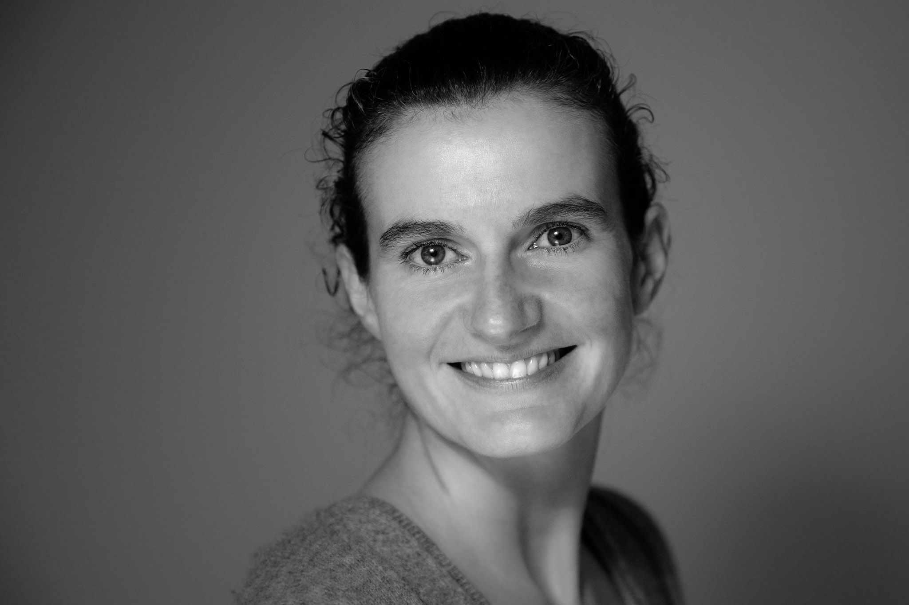

---

---
<link rel="stylesheet" href="styles.css" type="text/css">

 

I am a Data Scientist at VG, Norway's largest news destination. 

Outside the newsroom, my lastest NLP projects include the development and deployment of several [topic models](https://en.wikipedia.org/wiki/Latent_Dirichlet_allocation) via a [plumber api](https://www.rplumber.io). I do my own data engineering.  [Shiny apps](https://shiny.rstudio.com) are some of my favorite tools for prototyping and data visualization. 

Inside the newsroom, I was honored to contribute to a Norwegian Pulitzer diploma project in 2018 for [Tolga](https://www.vg.no/spesial/2018/pu-tilskuddene/) and to work on the Norwegian Pulitzer winning project of 2016 for [The unlawful use of physical restraints in Norwegian psychiatric wards](https://www.vg.no/spesial/2016/tvangsprotokollene/).

I am a R enthusiast and a member of [R Ladies](https://rladies.org). I co-founded the [R Ladies Oslo](https://www.meetup.com/rladies-oslo/events/) chapter in 2018 with fellow R Ladies while meeting at RStudio::Conf 2018 in San Diego.

I have a master degree in Economics from [The Norwegian Business School BI](https://www.bi.no), where I am a guess lecturer. 

