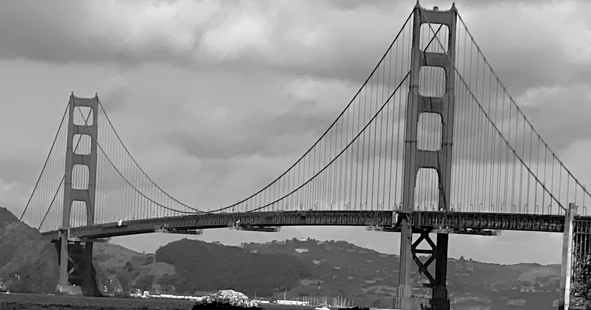
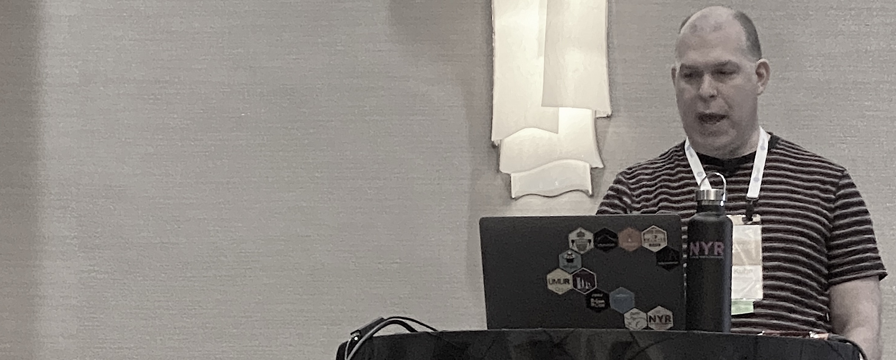
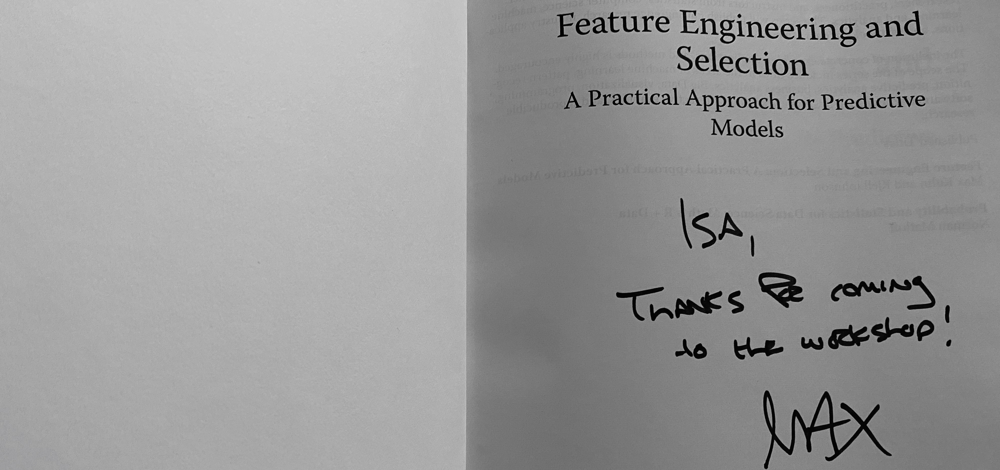
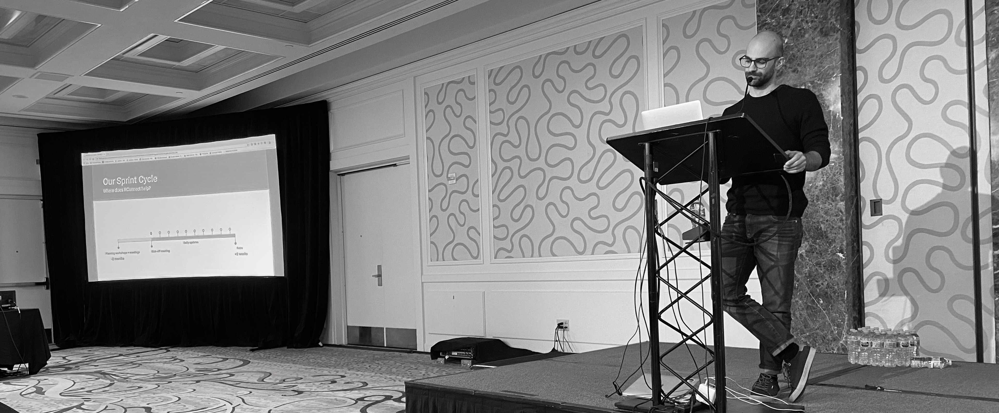
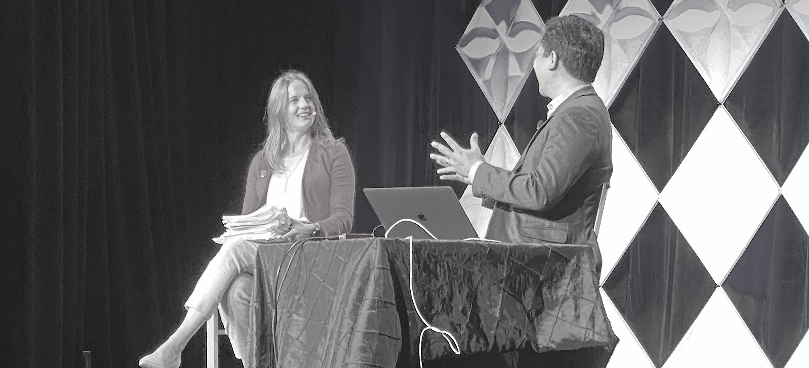
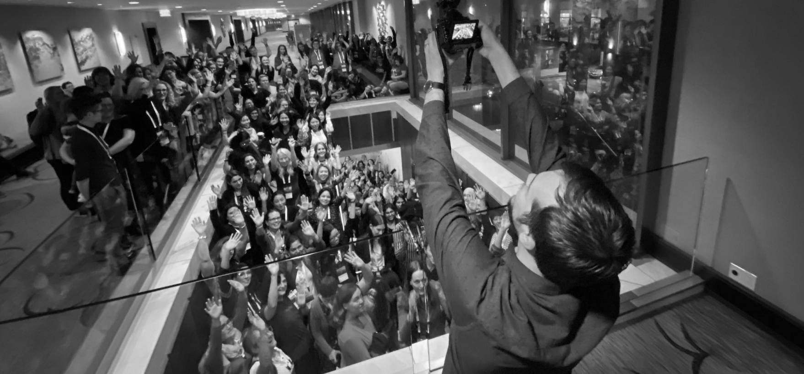

---
---

 

 
 

 

# rstudio::conf 2020 - San Francisco

One word to summarize rstudio::conf 2020: **Sharing**.

Rstudio::conf is a great sharing experience. Mind you, sharing consists of giving and receiving and I received a LOT!

This is what you can expect coming to a [RStudio](https://rstudio.com) Conference:

- You get amazing **keynotes**, **presentations** and **R resources** (even more so if you go to the workshops before the conference).

- You see R things that **you have never seen before**.

- You get **inspired** and make **new friends**.

- You get even prouder (if that is possible) to belong to this **amazing community of talents**.

## Resources from the workshop

I was lucky to join the rstudio::conf twice: Once in San Diego and now in San Francisco. I see that what I use the most once the conference is over is the notes and tips from the workshop. The workshops are very hands-on, with practical exercises and best practices. I have found that they directly impact productivity, support problem-solving skills and increase your coding proficiency.  So, if you can join them, do!  What is great about the workshops is that, all the notes and slides from all the workshops are **shared** with the participants. If like me, there were several workshops you would have liked to attend, but could not, you can get the [materials](https://github.com/rstudio-conf-2020) from these workshops!

It is the same with the keynotes and presentations. All is **shared** both with participants and later on, none participants.

### San Diego

In San Diego, I learn tidyeval and my favorite R tips to date: to edit with multiple cursors on multiple lines, using Alt, then dragging with the mouse. It creates a rectangular selection where you need the multiple cursors to be. I have used this tip weekly since San Diego. It speeds up how I code, edit code and do debugging.

### San Francisco

In San Francisco, I joined the Applied Machine Learning workshop with [Max Kuhn](https://twitter.com/topepos) and [Davis Vaughan](https://twitter.com/dvaughan32). What I liked the most was the best practices on the modeling workflow. We also learned proper naming convention for recipes, models, tuning, etc. And of course, all of Max's stories on modeling make the workshop a fun experience to be a part of. I will now translate my notes into a short(er) presentation and **share** with colleagues, [RLadies](https://rladies.org) and [UseRs](https://jumpingrivers.github.io/meetingsR/r-user-groups.html) back in Norway.

### Book Signing

When it comes to resources, I must mention the book signing. I have never seen anything like it. I will come home with 6 R books signed by the authors. Each author wrote a personal note to each and everyone of us, so lucky to be **given** the books. I will go home with:

- Deep Learning with R by Francois Chollet and JJ Allaire

- Feature Engineering and selection by Max Kuhn and Kjell Johnson

- Interactive web-based data visualization with R, plotly, and shiny by Carson Sievert

- Mastering spark with R by Javier Luraschi, Kevin Kuo and Edgar Ruiz

- R Graphics Cookbook by Winston Chang

- R Markdown by Yihui Xie, JJ Allaire and Garrett Grolemund

## Resources from the conference 

### Keynotes
It seems to me that the red thread in rstudio::conf is on how to work better, faster and more efficiently with R. This is why I love [Jenny Brian](https://twitter.com/JennyBryan)'s humorous keynote on [debugging](https://github.com/jennybc/debugging#readme). Learning to debug properly is an underrated skills among data scientists. I think we like to talk about modeling more than debugging frankly. And yet, considering how we spend our time...Well, let's just say that Jenny's presentation was spot-on.

### Never ever seen before...
There is nothing that I like more than many of my interests combined together in one glorious presentation. During the kick-off breakfast of [RLadies](https://rladies.org) on Wednesday, I saw one such R presentation. It was unlike anything I had seen before: art, art history and R all in one.

[Mine Dogucu](https://twitter.com/MineDogucu) from the department of Statistics at UC Irvine had a unique presentation called "Five art pieces that every R users should know". She showed us the connection between R and René Magritte, the history of the first word cloud and some dishes from a certain dinner party that you will not forget. Curious? Get in touch with Mine.

### Inspiration and new friends

Coming from the media industry, I must say that one of my favorite presentations was "Building a new data science pipeline for the Financial Times (FT) with RStudio Connect". [George Kastrinakis](https://www.linkedin.com/in/george-kastrinakis-abba83b9/), data scientist at the FT was presenting. I recognized all the challenges and tasks that George was talking about. It always surprises me to see how much in common we, R users, have. And if you are coming from the same industry even more so. 

 

I quickly connected with George and we had breakfast together the next day. We shared our experiences, challenges and impactful projects together. I hope my team can visit the FT soon and George's team can visit us in Norway. Let's see what happen. In any case, at rstudio::conf, you make many new R friends! George, you also motivated me to become a speaker at the next rstudio::conf. Thanks for the inspiration and thanks for **sharing**!

## An amazing community of talents

 

While I received a lot at the conference, my highlights were in giving. I gave a big big hug to [Roger Peng](https://twitter.com/rdpeng) after he and [Hilary Parker](https://twitter.com/hspter) did the 100th [podcast](http://nssdeviations.com) of **Not so standard deviation**. It was important to me to say thank you to Roger. His Data Science Specialization on Coursera (together with Brian Caffo and Jeff Leek) launched my career as a Data Scientist back in 2013. 

I also gave a big hug to [Hadley](https://twitter.com/hadleywickham) and thanked him for all the he is doing/has been doing for the R community. I gave (many) hugs to the incomparable [Julia Silge](https://twitter.com/juliasilge) who has done a lot in 2019 to make our community safe, inclusive and respectful for all R users (Could not find you, [Mara Averick](https://twitter.com/dataandme) - Wanted to say a big thank you to you too!!). I gave hugs to Anne Carome almost every day. Anne is the great organizer behind rstudio::conf. 

Finally, I feel so proud and honored to be part of the global movement that is [RLadies](https://rladies.org). You, ladies have giving many a voice (including myself)! You are rocking my world! 😍😍

This whole conference has been a big highlight for me. Thanks to everybody involved! 

 
 

